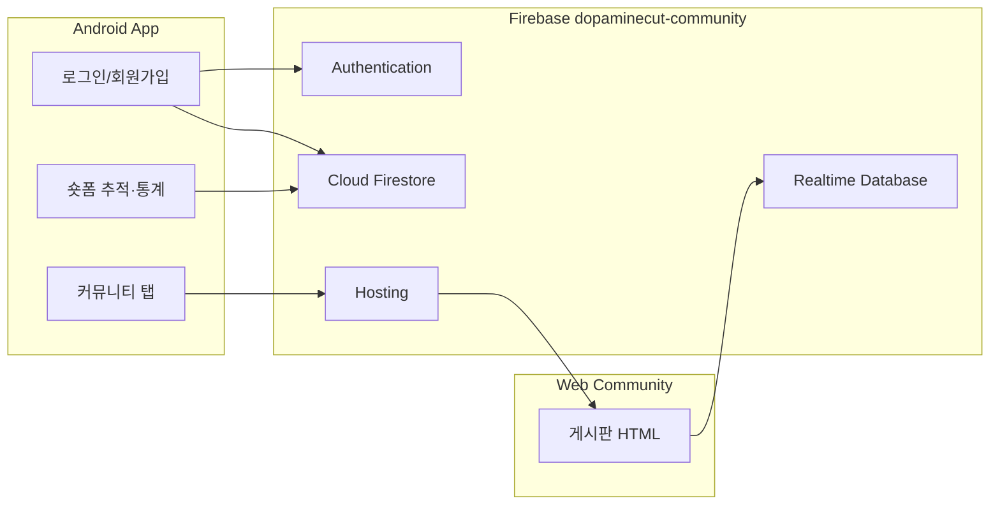

# DopamineCut Firebase 연동 가이드

프로젝트: **[dopaminecut-community](https://console.firebase.google.com/project/dopaminecut-community/overview)**

이 문서는 DopamineCut의 **안드로이드 앱**과 **웹 커뮤니티**를 같은 Firebase 프로젝트에 연결하는 전체 절차를 정리합니다.

---

## 목차

1. [아키텍처 한눈에 보기](#1-아키텍처-한눈에-보기)
2. [사전 준비](#2-사전-준비)
3. [Firebase 콘솔 초기 설정 (필수)](#3-firebase-콘솔-초기-설정-필수)
4. [안드로이드 앱 연동](#4-안드로이드-앱-연동)
5. [웹 커뮤니티 연동](#5-웹-커뮤니티-연동)
6. [Android Studio에서 실행](#6-android-studio에서-실행)
7. [동작 확인 체크리스트](#7-동작-확인-체크리스트)
8. [오류 메시지별 해결](#8-오류-메시지별-해결)
9. [보안·운영 참고](#9-보안운영-참고)
10. [저장소 내 관련 파일](#10-저장소-내-관련-파일)

---

## 1. 아키텍처 한눈에 보기

DopamineCut은 **하나의 Firebase 프로젝트** 안에서 DB를 두 가지로 나눠 씁니다.




| 기능         | 사용 서비스                         | 데이터 경로                                                                         |
| ---------- | ------------------------------ | ------------------------------------------------------------------------------ |
| 앱 회원가입·로그인 | Authentication + **Firestore** | `users/{uid}`                                                                  |
| 앱 숏폼 로그·통계 | **Firestore**                  | `dopamine_logs`, `daily_statistics`                                            |
| 웹 게시판      | **Realtime Database**          | `community_posts`                                                              |
| 웹 배포 URL   | **Hosting**                    | [https://dopaminecut-community.web.app](https://dopaminecut-community.web.app) |


> **주의:** Realtime Database에 `community_posts`가 보여도, 앱 회원가입은 **Firestore + Auth** 설정이 따로 필요합니다.

---

## 2. 사전 준비


| 항목                   | 내용                                                                |
| -------------------- | ----------------------------------------------------------------- |
| Firebase 프로젝트        | `dopaminecut-community` (이미 생성됨)                                  |
| Android Studio       | `Application` 폴더를 프로젝트로 열기                                        |
| Node.js (웹 로컬 테스트 시) | Community-Web용                                                    |
| 앱 패키지명               | `com.example.dopaminecut2` (변경 시 콘솔·`google-services.json`도 동일하게) |


---

## 3. Firebase 콘솔 초기 설정 (필수)

아래 **3가지를 모두** 완료해야 앱 회원가입이 정상 동작합니다.

### 3-1. Authentication — 이메일/비밀번호 (가장 먼저)

1. [Authentication → Sign-in method](https://console.firebase.google.com/project/dopaminecut-community/authentication/providers) 이동
2. **이메일/비밀번호** (Email/Password) 클릭
3. **사용 설정** ON
4. **저장**

**이 설정이 꺼져 있으면** 앱에 아래 메시지가 뜹니다.

> 회원가입 실패: Firebase에서 이메일/비밀번호 로그인을 켜주세요.

---

### 3-2. Cloud Firestore — 앱 DB (회원가입 필수)

#### 데이터베이스 생성

1. [Firestore Database](https://console.firebase.google.com/project/dopaminecut-community/firestore) 이동
2. **데이터베이스 만들기** 클릭
3. 모드 선택
  - **개발/테스트:** 테스트 모드 (30일간 개방, 이후 규칙 필요)
  - **권장:** 프로덕션 모드 + 아래 규칙 즉시 게시
4. 위치: **asia-northeast3 (서울)** 권장
5. **사용 설정** 완료

#### 보안 규칙 게시

1. Firestore 상단 **규칙** 탭
2. `firebase/firestore.rules.json` 내용을 **전부** 붙여넣기
3. **게시**

```javascript
rules_version = '2';
service cloud.firestore {
  match /databases/{database}/documents {
    match /users/{userId} {
      allow read: if request.auth != null;
      allow create: if request.auth != null && request.auth.uid == userId;
      allow update: if request.auth != null && request.auth.uid == userId;
    }
    match /dopamine_logs/{logId} {
      allow read, create: if request.auth != null;
    }
    match /daily_statistics/{docId} {
      allow read, write: if request.auth != null;
    }
  }
}
```

#### 회원가입 성공 시 데이터 예시

Firestore **데이터** 탭:

```
users
 └── {Firebase Auth UID}
      ├── email: "user@example.com"
      ├── nickname: "닉네임"
      ├── created_at: (타임스탬프)
      ├── restrictions: []
      └── inventory: { poke: 0, megaphone: 0 }
```

---

### 3-3. Realtime Database — 웹 게시판

1. [Realtime Database](https://console.firebase.google.com/project/dopaminecut-community/database) 이동
2. DB가 없으면 **데이터베이스 만들기** (위치: us-central1 등)
3. **규칙** 탭 → `firebase/database.rules.json` 참고 후 게시

개발용 예시 규칙 (`firebase/database.rules.json`):

```json
{
  "rules": {
    "community_posts": {
      ".read": true,
      "$postId": {
        ".write": true,
        "comments": {
          "$commentId": {
            ".write": true
          }
        }
      }
    }
  }
}
```

> 콘솔에 **「보안 규칙이 공개로 정의되어…」** 경고가 보이면 연동은 된 것이고, 규칙이 누구나 읽기/쓰기 가능한 상태입니다. 배포 전 인증 규칙으로 강화하세요.

#### 웹 게시판 데이터 예시

```
community_posts
 └── {postId}
      ├── nickname, score, text (또는 author, content)
      ├── emoji, createdAt, likes
      └── comments / {commentId}  (선택, 기존 UI 호환)
```

---

## 4. 안드로이드 앱 연동

### 4-1. Android 앱 등록 + google-services.json

1. [프로젝트 설정 → 일반](https://console.firebase.google.com/project/dopaminecut-community/settings/general)
2. **앱 추가** → **Android**
3. Android 패키지 이름: `com.example.dopaminecut2`
4. **앱 등록** → `**google-services.json` 다운로드**
5. 저장 위치 (덮어쓰기):

```
Application/app/google-services.json
```


| 항목             | 현재 프로젝트 값                                       |
| -------------- | ----------------------------------------------- |
| project_id     | `dopaminecut-community`                         |
| package_name   | `com.example.dopaminecut2`                      |
| Android App ID | `1:440075672976:android:48741219a0259e3c62a715` |


> 웹 앱 ID(`...:web:...`)와 Android App ID(`...:android:...`)는 **다릅니다.** 콘솔에서 Android용 JSON을 받아 써야 합니다.

### 4-2. local.properties (SDK 경로)

`Application/local.properties` (없으면 생성):

```properties
sdk.dir=C\:\\Users\\dw_42\\AppData\\Local\\Android\\Sdk
```

본인 PC의 Android SDK 경로에 맞게 수정하세요.

### 4-3. 앱 매니페스트

`INTERNET` 권한이 포함되어 있어야 Firebase 통신이 됩니다 (`Application/app/src/main/AndroidManifest.xml`).

---

## 5. 웹 커뮤니티 연동

### 5-1. 메인 UI (점수 랭킹 피드)

`Community-Web/index.html` — 다크 테마, 도파민 점수에 따라 1~3위 글자 크기·강조.

### 5-2. Firebase 설정

`Community-Web/index.html` 하단 `firebaseConfig`:


| 키           | 값                                                           |
| ----------- | ----------------------------------------------------------- |
| projectId   | `dopaminecut-community`                                     |
| databaseURL | `https://dopaminecut-community-default-rtdb.firebaseio.com` |
| authDomain  | `dopaminecut-community.firebaseapp.com`                     |


### 5-3. 로컬 실행

```bash
cd Community-Web
npm install
npm run dev
```

브라우저: [http://localhost:5173](http://localhost:5173)

### 5-4. 배포 (Hosting)

이미 배포된 주소: **[https://dopaminecut-community.web.app](https://dopaminecut-community.web.app)**

재배포:

```bash
cd Community-Web
npm run build

cd ../firebase
npx firebase-tools login
npx firebase-tools deploy --only hosting,database
```

### 5-5. 앱에서 웹 열기

`Application/app/src/main/res/values/strings.xml`:

```xml
<string name="community_web_base_url">https://dopaminecut-community.web.app</string>
```


| 환경            | URL                                     |
| ------------- | --------------------------------------- |
| 배포(기본)        | `https://dopaminecut-community.web.app` |
| 에뮬레이터 + PC 로컬 | `http://10.0.2.2:5173`                  |
| 실제 폰 + PC 로컬  | `http://<PC_IP>:5173`                   |


앱 → **커뮤니티** 탭 → **웹 커뮤니티 열기** 시 `?uid=…&nickname=…&score=…` 파라미터가 붙습니다.

---

## 6. Android Studio에서 실행

### 6-1. 프로젝트 열기

**File → Open** → `DopamineCut/Application` 폴더 선택  
(루트 `DopamineCut`만 열면 Run 구성 `app`이 안 보일 수 있음)

### 6-2. Gradle Sync

**File → Sync Project with Gradle Files** 완료 후 상단에서 **app** 선택 → ▶ Run

### 6-3. 한글 경로(바탕 화면) 이슈

`Application/gradle.properties`에 다음이 있으면 빌드 허용:

```properties
android.overridePathCheck=true
```

### 6-4. JDK

**Settings → Build Tools → Gradle → Gradle JDK:** JDK 17 또는 21 (Embedded JDK 권장)

---

## 7. 동작 확인 체크리스트

### Firebase 콘솔

- Authentication → 이메일/비밀번호 **사용**
- Firestore 데이터베이스 **생성됨**
- Firestore 규칙 **게시됨**
- Realtime Database **생성됨**, `community_posts` 접근 가능
- Android 앱 `com.example.dopaminecut2` **등록됨**

### 안드로이드 앱

- `Application/app/google-services.json` 콘솔에서 받은 파일로 교체
- 회원가입 → 토스트 **「회원가입 완료!」**
- Firestore `users` 문서 생성 확인
- 로그인 → 메인 화면 이동
- 커뮤니티 → 웹 게시판 열림

### 웹

- [https://dopaminecut-community.web.app](https://dopaminecut-community.web.app) 에서 글 목록·글쓰기
- 또는 `npm run dev` 로컬에서 동일 동작

---

## 8. 오류 메시지별 해결


| 앱 토스트 / 증상                     | 원인            | 해결                                                       |
| ------------------------------ | ------------- | -------------------------------------------------------- |
| **이메일/비밀번호 로그인을 켜주세요**         | Auth 비활성      | [3-1 Authentication](#3-1-authentication--이메일비밀번호-가장-먼저) |
| Firestore 권한이 없습니다             | 규칙 미게시        | [3-2 규칙 게시](#보안-규칙-게시)                                   |
| Firestore가 아직 생성되지 않았을 수 있습니다  | Firestore 미생성 | [3-2 데이터베이스 생성](#데이터베이스-생성)                              |
| 이미 사용 중인 이메일                   | Auth에 계정 존재   | 로그인 화면에서 로그인                                             |
| 비밀번호 6자리 이상                    | 앱 입력 검증       | 비밀번호 길이 확인                                               |
| 인터넷 연결 확인                      | 네트워크 / 권한     | Wi‑Fi·데이터, `INTERNET` 권한                                 |
| Run 버튼 비활성 (Add Configuration) | 잘못된 폴더로 Open  | `Application` 폴더로 다시 Open                                |
| Gradle SDK not found           | SDK 경로        | `local.properties` 작성                                    |


### 회원가입 처리 순서 (앱 코드)

```
1. Firebase Auth  → createUserWithEmailAndPassword
2. Firestore      → users/{uid} 문서 저장
```

1번만 성공하고 2번이 실패하면, 이전에는 같은 이메일로 재가입이 어려웠을 수 있습니다.  
현재 앱은 Firestore 실패 시 Auth 계정을 **자동 삭제(롤백)** 하도록 되어 있습니다.

---

## 9. 보안·운영 참고


| 항목                      | 권장                                                                |
| ----------------------- | ----------------------------------------------------------------- |
| Realtime Database 공개 규칙 | 개발용만 사용, 배포 전 인증·검증 규칙으로 변경                                       |
| Firestore 테스트 모드        | 30일 후 차단 → `firestore.rules.json` 게시                              |
| API 키                   | `google-services.json`·`index.html`에 포함 — 저장소 공개 시 키 제한(앱/도메인) 설정 |
| `google-services.json`  | `.gitignore` 대상 — 팀원은 각자 콘솔에서 다운로드                                |


---

## 10. 저장소 내 관련 파일


| 경로                                                | 설명                              |
| ------------------------------------------------- | ------------------------------- |
| `Application/app/google-services.json`            | Android Firebase 설정 (콘솔 다운로드)   |
| `Application/app/google-services.json.example`    | 템플릿                             |
| `Application/app/src/main/res/values/strings.xml` | 웹 커뮤니티 URL                      |
| `Community-Web/index.html`                        | 웹 Firebase + 게시판 UI             |
| `firebase/firestore.rules.json`                   | Firestore 보안 규칙                 |
| `firebase/database.rules.json`                    | RTDB 보안 규칙 (개발용)                |
| `firebase/firebase.json`                          | Hosting·RTDB 배포 설정              |
| `firebase/.firebaserc`                            | 프로젝트 ID `dopaminecut-community` |
| `Community-Web/README.md`                         | 웹 실행·배포 요약                      |


---

## 빠른 링크


| 서비스               | 콘솔 URL                                                                                                                                                                                   |
| ----------------- | ---------------------------------------------------------------------------------------------------------------------------------------------------------------------------------------- |
| 프로젝트 개요           | [https://console.firebase.google.com/project/dopaminecut-community/overview](https://console.firebase.google.com/project/dopaminecut-community/overview)                                 |
| Authentication    | [https://console.firebase.google.com/project/dopaminecut-community/authentication/providers](https://console.firebase.google.com/project/dopaminecut-community/authentication/providers) |
| Firestore         | [https://console.firebase.google.com/project/dopaminecut-community/firestore](https://console.firebase.google.com/project/dopaminecut-community/firestore)                               |
| Realtime Database | [https://console.firebase.google.com/project/dopaminecut-community/database](https://console.firebase.google.com/project/dopaminecut-community/database)                                 |
| Hosting           | [https://console.firebase.google.com/project/dopaminecut-community/hosting](https://console.firebase.google.com/project/dopaminecut-community/hosting)                                   |
| 프로젝트 설정           | [https://console.firebase.google.com/project/dopaminecut-community/settings/general](https://console.firebase.google.com/project/dopaminecut-community/settings/general)                 |
| 웹 커뮤니티 (배포)       | [https://dopaminecut-community.web.app](https://dopaminecut-community.web.app)                                                                                                           |


---

*마지막 업데이트: DopamineCut 저장소 기준 (dopaminecut-community, Android `com.example.dopaminecut2`)*